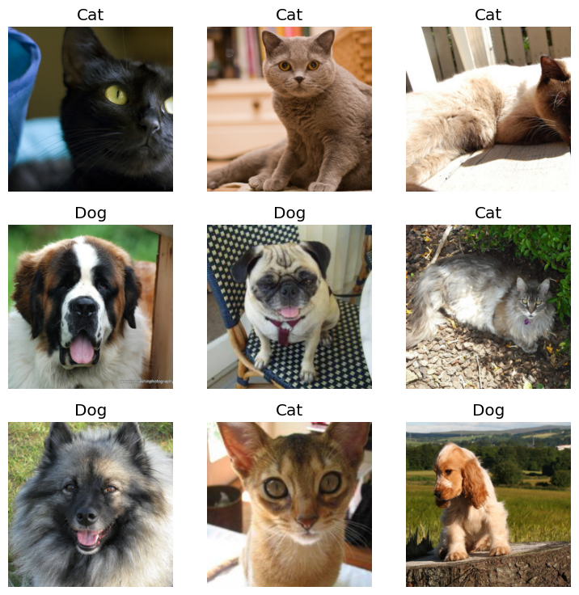
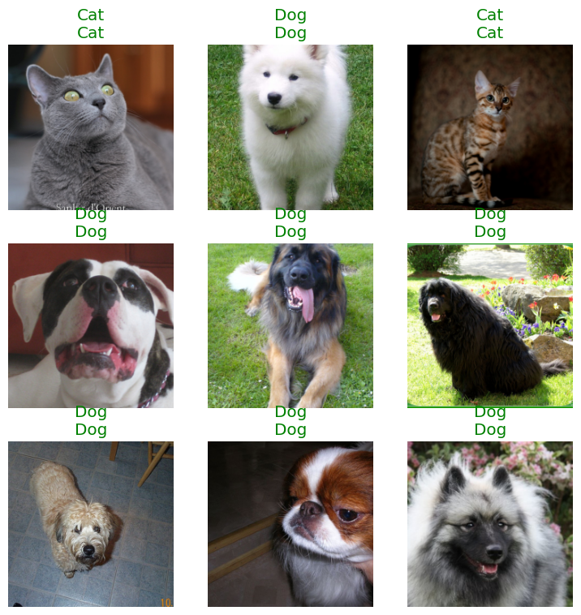
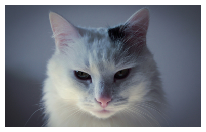
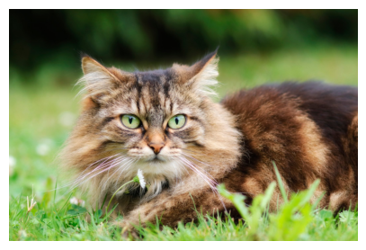
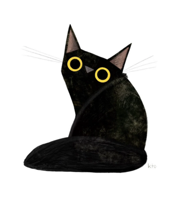
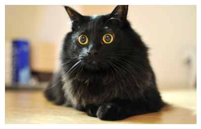
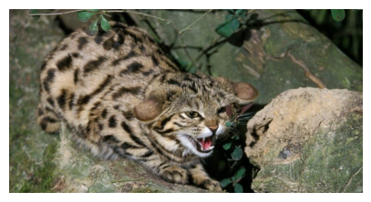
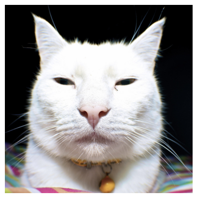
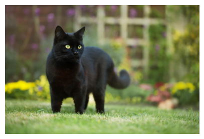

+++
title = 'A Simple Model for Cat vs. Dog Image Classification'
date = 2024-08-28T17:54:29-04:00
draft = false
summary = "This Colab notebook demonstrates how to build an dog or cat image classifier using the fastai library."
series = ["AI",]
weight = 2
tags = ["AI", "FastAI", "Machine Learning", "Computer Vision", "Image Classification", "Cat vs. Dog", "Deep Learning", "Neural Networks", "Convolutional Neural Networks (CNNs)", "Image Recognition", "Artificial Intelligence", "FastAI"]
author= ["Me"]
+++

This Colab notebook delves into the world of image classification, specifically focusing on the age-old challenge of identifying cats and dogs in pictures. To achieve this feat, we leverage the power of fast.ai, a high-level deep learning library renowned for its user-friendliness and efficiency.

The Oxford-IIIT Pet Dataset, a comprehensive collection of labeled cat and dog images, will serve as our training ground. We'll utilize fast.ai's intuitive functionalities, specifically the ImageDataLoaders class, to seamlessly load, manage, and pre-process our image data. This ensures our model receives images in a format that optimizes its learning process.

As the foundation of our classifier, we'll employ the well-respected ResNet-34 architecture. This deep neural network boasts impressive accuracy and efficiency in image classification tasks. Through the magic of fast.ai, we'll fine-tune this model on the Oxford-IIIT Pet Dataset, effectively tailoring its capabilities to the specific challenge of differentiating cats from dogs.

The error_rate metric will be our tool for evaluating the model's performance. This metric quantifies the model's accuracy in correctly classifying images. By minimizing the error_rate through fine-tuning with fast.ai, we aim to create a robust classifier that surpasses human-level accuracy in distinguishing these furry friends.


*Install Necessary libraries*


```python
!pip install -Uqq fastbook
!pip install fastai
```


```python
from fastai import *
from fastai.vision.all import *
```

Download [Dataset](https://www.robots.ox.ac.uk/~vgg/data/pets/). We will only be using images from this dataset.


```python
path = untar_data(URLs.PETS)
path.ls()

files = get_image_files(path/"images")
len(files)
```


    7390


This code snippet defines a function `label_func` to label images as 'Cat' or 'Dog' based on the capitalization of the first letter of the filename.

Then, it creates a `DataLoaders` object named dls using the `from_name_func` method. This object loads images from the specified path, applies the `label_func` for labeling, and resizes images to 224 pixels using `item_tfms`.

Finally, `dls.show_batch()` displays a batch of images from the dataset.


```python
def label_func(f):
    return 'Cat' if f[0].isupper() else 'Dog'

dls = ImageDataLoaders.from_name_func(path, files, label_func, item_tfms=Resize(224))
dls.show_batch()
```


    

    


This code creates a vision_learner object named learner using the DataLoaders object dls, a ResNet-34 model architecture, and the error_rate metric for evaluation.

Then, learner.fine_tune(1) fine-tunes the model for one epoch, adjusting its parameters to better fit the dataset.

Finally, learner.show_results() displays a sample of the model's predictions on the validation set, allowing you to visually assess its performance.


```python
learner = vision_learner(dls, resnet34, metrics=error_rate)
learner.fine_tune(1)

learner.show_results()
```


<style>
    /* Turns off some styling */
    progress {
        /* gets rid of default border in Firefox and Opera. */
        border: none;
        /* Needs to be in here for Safari polyfill so background images work as expected. */
        background-size: auto;
    }
    progress:not([value]), progress:not([value])::-webkit-progress-bar {
        background: repeating-linear-gradient(45deg, #7e7e7e, #7e7e7e 10px, #5c5c5c 10px, #5c5c5c 20px);
    }
    .progress-bar-interrupted, .progress-bar-interrupted::-webkit-progress-bar {
        background: #F44336;
    }
</style>


<table border="1" class="dataframe">
  <thead>
    <tr style="text-align: left;">
      <th>epoch</th>
      <th>train_loss</th>
      <th>valid_loss</th>
      <th>error_rate</th>
      <th>time</th>
    </tr>
  </thead>
  <tbody>
    <tr>
      <td>0</td>
      <td>0.143795</td>
      <td>0.030142</td>
      <td>0.010825</td>
      <td>00:53</td>
    </tr>
  </tbody>
</table>


<style>
    /* Turns off some styling */
    progress {
        /* gets rid of default border in Firefox and Opera. */
        border: none;
        /* Needs to be in here for Safari polyfill so background images work as expected. */
        background-size: auto;
    }
    progress:not([value]), progress:not([value])::-webkit-progress-bar {
        background: repeating-linear-gradient(45deg, #7e7e7e, #7e7e7e 10px, #5c5c5c 10px, #5c5c5c 20px);
    }
    .progress-bar-interrupted, .progress-bar-interrupted::-webkit-progress-bar {
        background: #F44336;
    }
</style>


<table border="1" class="dataframe">
  <thead>
    <tr style="text-align: left;">
      <th>epoch</th>
      <th>train_loss</th>
      <th>valid_loss</th>
      <th>error_rate</th>
      <th>time</th>
    </tr>
  </thead>
  <tbody>
    <tr>
      <td>0</td>
      <td>0.073295</td>
      <td>0.021773</td>
      <td>0.006089</td>
      <td>00:59</td>
    </tr>
  </tbody>
</table>


<style>
    /* Turns off some styling */
    progress {
        /* gets rid of default border in Firefox and Opera. */
        border: none;
        /* Needs to be in here for Safari polyfill so background images work as expected. */
        background-size: auto;
    }
    progress:not([value]), progress:not([value])::-webkit-progress-bar {
        background: repeating-linear-gradient(45deg, #7e7e7e, #7e7e7e 10px, #5c5c5c 10px, #5c5c5c 20px);
    }
    .progress-bar-interrupted, .progress-bar-interrupted::-webkit-progress-bar {
        background: #F44336;
    }
</style>


    

    


## Testing Model

Here we are download random 10 images from duckduckgo to test our model prediction.


```python
from fastbook import *
import random

urls = search_images_ddg('dog', max_images=50)
urls += search_images_ddg('cat', max_images=50)

urls = random.sample(urls, 10)


for i, url in enumerate(urls):
  try:
    download_url(url, f'images/{i}.jpg')
  except:
    print(f'Failed to download {url}')

files = get_image_files("images")

for file in files:
  img = PILImage.create(file)
  img.show()

  is_what, _, probs = learner.predict(file)

  print(f"Is this a : {is_what}.")
  print(f"Probability: {probs[1].item():.6f}")
```


<style>
    /* Turns off some styling */
    progress {
        /* gets rid of default border in Firefox and Opera. */
        border: none;
        /* Needs to be in here for Safari polyfill so background images work as expected. */
        background-size: auto;
    }
    progress:not([value]), progress:not([value])::-webkit-progress-bar {
        background: repeating-linear-gradient(45deg, #7e7e7e, #7e7e7e 10px, #5c5c5c 10px, #5c5c5c 20px);
    }
    .progress-bar-interrupted, .progress-bar-interrupted::-webkit-progress-bar {
        background: #F44336;
    }
</style>


<div>
  <progress value='245760' class='' max='244783' style='width:300px; height:20px; vertical-align: middle;'></progress>
  100.40% [245760/244783 00:00&lt;00:00]
</div>


<style>
    /* Turns off some styling */
    progress {
        /* gets rid of default border in Firefox and Opera. */
        border: none;
        /* Needs to be in here for Safari polyfill so background images work as expected. */
        background-size: auto;
    }
    progress:not([value]), progress:not([value])::-webkit-progress-bar {
        background: repeating-linear-gradient(45deg, #7e7e7e, #7e7e7e 10px, #5c5c5c 10px, #5c5c5c 20px);
    }
    .progress-bar-interrupted, .progress-bar-interrupted::-webkit-progress-bar {
        background: #F44336;
    }
</style>


<div>
  <progress value='221184' class='' max='218443' style='width:300px; height:20px; vertical-align: middle;'></progress>
  101.25% [221184/218443 00:00&lt;00:00]
</div>


<style>
    /* Turns off some styling */
    progress {
        /* gets rid of default border in Firefox and Opera. */
        border: none;
        /* Needs to be in here for Safari polyfill so background images work as expected. */
        background-size: auto;
    }
    progress:not([value]), progress:not([value])::-webkit-progress-bar {
        background: repeating-linear-gradient(45deg, #7e7e7e, #7e7e7e 10px, #5c5c5c 10px, #5c5c5c 20px);
    }
    .progress-bar-interrupted, .progress-bar-interrupted::-webkit-progress-bar {
        background: #F44336;
    }
</style>


<div>
  <progress value='245760' class='' max='244604' style='width:300px; height:20px; vertical-align: middle;'></progress>
  100.47% [245760/244604 00:00&lt;00:00]
</div>


<style>
    /* Turns off some styling */
    progress {
        /* gets rid of default border in Firefox and Opera. */
        border: none;
        /* Needs to be in here for Safari polyfill so background images work as expected. */
        background-size: auto;
    }
    progress:not([value]), progress:not([value])::-webkit-progress-bar {
        background: repeating-linear-gradient(45deg, #7e7e7e, #7e7e7e 10px, #5c5c5c 10px, #5c5c5c 20px);
    }
    .progress-bar-interrupted, .progress-bar-interrupted::-webkit-progress-bar {
        background: #F44336;
    }
</style>


<div>
  <progress value='139264' class='' max='134305' style='width:300px; height:20px; vertical-align: middle;'></progress>
  103.69% [139264/134305 00:00&lt;00:00]
</div>


<style>
    /* Turns off some styling */
    progress {
        /* gets rid of default border in Firefox and Opera. */
        border: none;
        /* Needs to be in here for Safari polyfill so background images work as expected. */
        background-size: auto;
    }
    progress:not([value]), progress:not([value])::-webkit-progress-bar {
        background: repeating-linear-gradient(45deg, #7e7e7e, #7e7e7e 10px, #5c5c5c 10px, #5c5c5c 20px);
    }
    .progress-bar-interrupted, .progress-bar-interrupted::-webkit-progress-bar {
        background: #F44336;
    }
</style>


<div>
  <progress value='360448' class='' max='359313' style='width:300px; height:20px; vertical-align: middle;'></progress>
  100.32% [360448/359313 00:00&lt;00:00]
</div>


<style>
    /* Turns off some styling */
    progress {
        /* gets rid of default border in Firefox and Opera. */
        border: none;
        /* Needs to be in here for Safari polyfill so background images work as expected. */
        background-size: auto;
    }
    progress:not([value]), progress:not([value])::-webkit-progress-bar {
        background: repeating-linear-gradient(45deg, #7e7e7e, #7e7e7e 10px, #5c5c5c 10px, #5c5c5c 20px);
    }
    .progress-bar-interrupted, .progress-bar-interrupted::-webkit-progress-bar {
        background: #F44336;
    }
</style>


<div>
  <progress value='90112' class='' max='84620' style='width:300px; height:20px; vertical-align: middle;'></progress>
  106.49% [90112/84620 00:00&lt;00:00]
</div>


<style>
    /* Turns off some styling */
    progress {
        /* gets rid of default border in Firefox and Opera. */
        border: none;
        /* Needs to be in here for Safari polyfill so background images work as expected. */
        background-size: auto;
    }
    progress:not([value]), progress:not([value])::-webkit-progress-bar {
        background: repeating-linear-gradient(45deg, #7e7e7e, #7e7e7e 10px, #5c5c5c 10px, #5c5c5c 20px);
    }
    .progress-bar-interrupted, .progress-bar-interrupted::-webkit-progress-bar {
        background: #F44336;
    }
</style>


<div>
  <progress value='425984' class='' max='425175' style='width:300px; height:20px; vertical-align: middle;'></progress>
  100.19% [425984/425175 00:00&lt;00:00]
</div>


<style>
    /* Turns off some styling */
    progress {
        /* gets rid of default border in Firefox and Opera. */
        border: none;
        /* Needs to be in here for Safari polyfill so background images work as expected. */
        background-size: auto;
    }
    progress:not([value]), progress:not([value])::-webkit-progress-bar {
        background: repeating-linear-gradient(45deg, #7e7e7e, #7e7e7e 10px, #5c5c5c 10px, #5c5c5c 20px);
    }
    .progress-bar-interrupted, .progress-bar-interrupted::-webkit-progress-bar {
        background: #F44336;
    }
</style>


<div>
  <progress value='98304' class='' max='98020' style='width:300px; height:20px; vertical-align: middle;'></progress>
  100.29% [98304/98020 00:00&lt;00:00]
</div>


<style>
    /* Turns off some styling */
    progress {
        /* gets rid of default border in Firefox and Opera. */
        border: none;
        /* Needs to be in here for Safari polyfill so background images work as expected. */
        background-size: auto;
    }
    progress:not([value]), progress:not([value])::-webkit-progress-bar {
        background: repeating-linear-gradient(45deg, #7e7e7e, #7e7e7e 10px, #5c5c5c 10px, #5c5c5c 20px);
    }
    .progress-bar-interrupted, .progress-bar-interrupted::-webkit-progress-bar {
        background: #F44336;
    }
</style>


<div>
  <progress value='73728' class='' max='69314' style='width:300px; height:20px; vertical-align: middle;'></progress>
  106.37% [73728/69314 00:00&lt;00:00]
</div>


<style>
    /* Turns off some styling */
    progress {
        /* gets rid of default border in Firefox and Opera. */
        border: none;
        /* Needs to be in here for Safari polyfill so background images work as expected. */
        background-size: auto;
    }
    progress:not([value]), progress:not([value])::-webkit-progress-bar {
        background: repeating-linear-gradient(45deg, #7e7e7e, #7e7e7e 10px, #5c5c5c 10px, #5c5c5c 20px);
    }
    .progress-bar-interrupted, .progress-bar-interrupted::-webkit-progress-bar {
        background: #F44336;
    }
</style>


<div>
  <progress value='65536' class='' max='57504' style='width:300px; height:20px; vertical-align: middle;'></progress>
  113.97% [65536/57504 00:00&lt;00:00]
</div>


<style>
    /* Turns off some styling */
    progress {
        /* gets rid of default border in Firefox and Opera. */
        border: none;
        /* Needs to be in here for Safari polyfill so background images work as expected. */
        background-size: auto;
    }
    progress:not([value]), progress:not([value])::-webkit-progress-bar {
        background: repeating-linear-gradient(45deg, #7e7e7e, #7e7e7e 10px, #5c5c5c 10px, #5c5c5c 20px);
    }
    .progress-bar-interrupted, .progress-bar-interrupted::-webkit-progress-bar {
        background: #F44336;
    }
</style>


    Is this a : Cat.
    Probability: 0.000000


<style>
    /* Turns off some styling */
    progress {
        /* gets rid of default border in Firefox and Opera. */
        border: none;
        /* Needs to be in here for Safari polyfill so background images work as expected. */
        background-size: auto;
    }
    progress:not([value]), progress:not([value])::-webkit-progress-bar {
        background: repeating-linear-gradient(45deg, #7e7e7e, #7e7e7e 10px, #5c5c5c 10px, #5c5c5c 20px);
    }
    .progress-bar-interrupted, .progress-bar-interrupted::-webkit-progress-bar {
        background: #F44336;
    }
</style>


    Is this a : Cat.
    Probability: 0.000000


<style>
    /* Turns off some styling */
    progress {
        /* gets rid of default border in Firefox and Opera. */
        border: none;
        /* Needs to be in here for Safari polyfill so background images work as expected. */
        background-size: auto;
    }
    progress:not([value]), progress:not([value])::-webkit-progress-bar {
        background: repeating-linear-gradient(45deg, #7e7e7e, #7e7e7e 10px, #5c5c5c 10px, #5c5c5c 20px);
    }
    .progress-bar-interrupted, .progress-bar-interrupted::-webkit-progress-bar {
        background: #F44336;
    }
</style>


    Is this a : Cat.
    Probability: 0.000000


<style>
    /* Turns off some styling */
    progress {
        /* gets rid of default border in Firefox and Opera. */
        border: none;
        /* Needs to be in here for Safari polyfill so background images work as expected. */
        background-size: auto;
    }
    progress:not([value]), progress:not([value])::-webkit-progress-bar {
        background: repeating-linear-gradient(45deg, #7e7e7e, #7e7e7e 10px, #5c5c5c 10px, #5c5c5c 20px);
    }
    .progress-bar-interrupted, .progress-bar-interrupted::-webkit-progress-bar {
        background: #F44336;
    }
</style>


    Is this a : Dog.
    Probability: 0.999783


<style>
    /* Turns off some styling */
    progress {
        /* gets rid of default border in Firefox and Opera. */
        border: none;
        /* Needs to be in here for Safari polyfill so background images work as expected. */
        background-size: auto;
    }
    progress:not([value]), progress:not([value])::-webkit-progress-bar {
        background: repeating-linear-gradient(45deg, #7e7e7e, #7e7e7e 10px, #5c5c5c 10px, #5c5c5c 20px);
    }
    .progress-bar-interrupted, .progress-bar-interrupted::-webkit-progress-bar {
        background: #F44336;
    }
</style>


    Is this a : Cat.
    Probability: 0.000000


<style>
    /* Turns off some styling */
    progress {
        /* gets rid of default border in Firefox and Opera. */
        border: none;
        /* Needs to be in here for Safari polyfill so background images work as expected. */
        background-size: auto;
    }
    progress:not([value]), progress:not([value])::-webkit-progress-bar {
        background: repeating-linear-gradient(45deg, #7e7e7e, #7e7e7e 10px, #5c5c5c 10px, #5c5c5c 20px);
    }
    .progress-bar-interrupted, .progress-bar-interrupted::-webkit-progress-bar {
        background: #F44336;
    }
</style>


    Is this a : Cat.
    Probability: 0.000000


<style>
    /* Turns off some styling */
    progress {
        /* gets rid of default border in Firefox and Opera. */
        border: none;
        /* Needs to be in here for Safari polyfill so background images work as expected. */
        background-size: auto;
    }
    progress:not([value]), progress:not([value])::-webkit-progress-bar {
        background: repeating-linear-gradient(45deg, #7e7e7e, #7e7e7e 10px, #5c5c5c 10px, #5c5c5c 20px);
    }
    .progress-bar-interrupted, .progress-bar-interrupted::-webkit-progress-bar {
        background: #F44336;
    }
</style>


    Is this a : Dog.
    Probability: 0.999754


<style>
    /* Turns off some styling */
    progress {
        /* gets rid of default border in Firefox and Opera. */
        border: none;
        /* Needs to be in here for Safari polyfill so background images work as expected. */
        background-size: auto;
    }
    progress:not([value]), progress:not([value])::-webkit-progress-bar {
        background: repeating-linear-gradient(45deg, #7e7e7e, #7e7e7e 10px, #5c5c5c 10px, #5c5c5c 20px);
    }
    .progress-bar-interrupted, .progress-bar-interrupted::-webkit-progress-bar {
        background: #F44336;
    }
</style>


    Is this a : Cat.
    Probability: 0.000000


<style>
    /* Turns off some styling */
    progress {
        /* gets rid of default border in Firefox and Opera. */
        border: none;
        /* Needs to be in here for Safari polyfill so background images work as expected. */
        background-size: auto;
    }
    progress:not([value]), progress:not([value])::-webkit-progress-bar {
        background: repeating-linear-gradient(45deg, #7e7e7e, #7e7e7e 10px, #5c5c5c 10px, #5c5c5c 20px);
    }
    .progress-bar-interrupted, .progress-bar-interrupted::-webkit-progress-bar {
        background: #F44336;
    }
</style>


    Is this a : Cat.
    Probability: 0.000000


<style>
    /* Turns off some styling */
    progress {
        /* gets rid of default border in Firefox and Opera. */
        border: none;
        /* Needs to be in here for Safari polyfill so background images work as expected. */
        background-size: auto;
    }
    progress:not([value]), progress:not([value])::-webkit-progress-bar {
        background: repeating-linear-gradient(45deg, #7e7e7e, #7e7e7e 10px, #5c5c5c 10px, #5c5c5c 20px);
    }
    .progress-bar-interrupted, .progress-bar-interrupted::-webkit-progress-bar {
        background: #F44336;
    }
</style>


    Is this a : Cat.
    Probability: 0.000000


    

    


    

    


    

    


    

    


    

    


    

    


    

    


    

    


    

    


    

    

